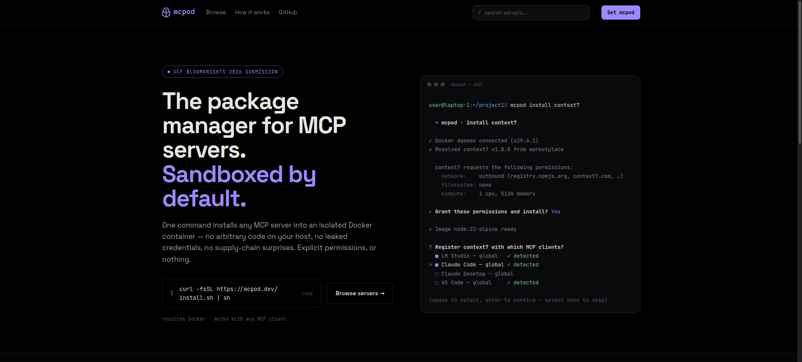
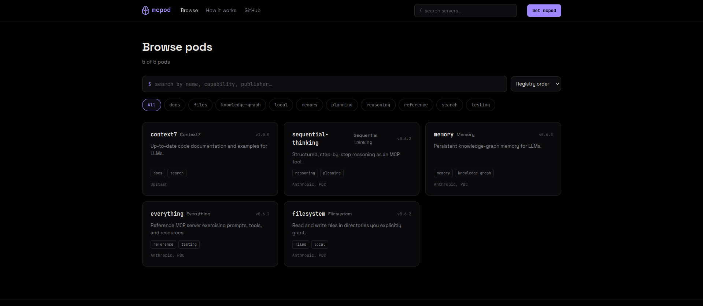
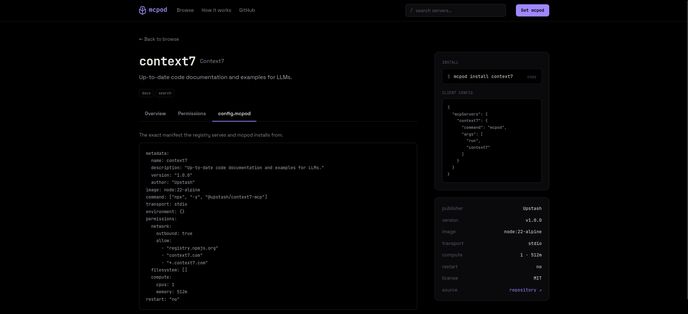
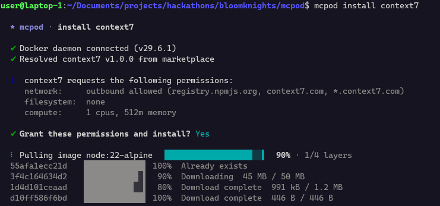
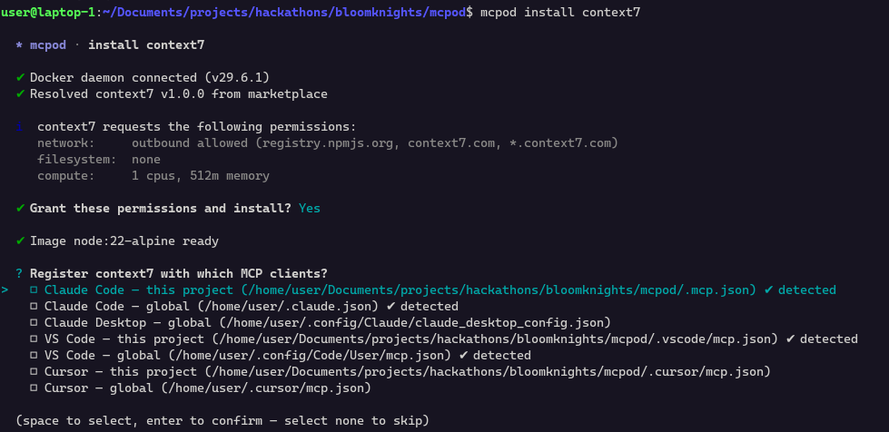
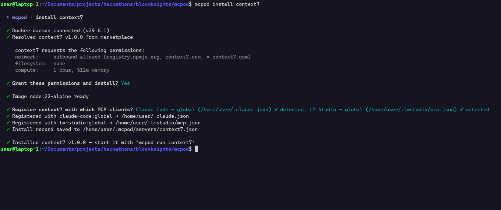
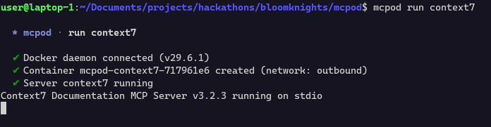

<p align="center">
  
</p>

**mcpod** (MCP + Pod) is a command-line tool for installing, managing, and running [Model Context Protocol (MCP)](https://modelcontextprotocol.io/) servers inside isolated Docker containers.

This project was built for the **2026 UCF Bloomknights 12-hour hackathon**. The goal is to make MCP servers easier to try, safer to run, and simpler to connect to popular AI development clients without giving every server unrestricted access to your machine.

## Why mcpod?

MCP servers can be powerful: they expose tools, data sources, and local capabilities to AI assistants. That also means they deserve a careful runtime boundary. mcpod treats each server like an app with an explicit permission request:

- no network access unless the server's `config.mcpod` asks for it,
- no filesystem access unless the server's `config.mcpod` asks for it,
- bind mounts are scoped and read-only by default;

## Features

- 📦 **Containerized MCP servers** — run installed MCP servers as Docker containers instead of directly on your host.
- 🔎 **Marketplace browsing** — search, list, inspect, and fetch server configs from an MCP server registry.
- 🛠️ **One-command installs** — install marketplace entries, local paths, or Git repositories that provide a `config.mcpod` file.
- 🛡️ **Permission-first runtime** — enforce declared network, filesystem, and compute permissions when containers are created.
- 🔄 **Client registration** — register installed servers with Claude Code, Claude Desktop, VS Code, Cursor, or LM Studio.
- 🕒 **Lifecycle management** — start, stop, remove, and update installed servers from the CLI.
- 🤖 **Automatic Config Generation** — `--interpret-unsafe` can use Gemini to generate a `config.mcpod` from docs when a server does not provide one, but only after the user explicitly opts in.

## Web marketplace

Alongside the CLI, mcpod ships a web frontend for discovering servers before you install them. The landing page pitches the sandbox-by-default model and shows the install flow in action:



Browse the registry, filter by capability, name, or publisher, and see every available pod at a glance:



Open any server to inspect its overview, requested permissions, and the exact `config.mcpod` manifest the registry serves — plus a one-line install command and ready-to-copy client config:



## Requirements

- Node.js 26
- npm
- Docker running locally for container operations
- Optional: Gemini API key in `GEMINI_API_KEY` for `mcpod install --interpret-unsafe`

## Getting started

Clone the repository and install workspace dependencies:

```bash
git clone <repo-url>
cd mcpod
npm install
```

Run the CLI locally without linking:

```bash
node cli/bin/mcpod.js --help
```

Or link the package during development so `mcpod` is available on your PATH:

```bash
cd cli
npm link
mcpod --help
```

## CLI usage

```bash
mcpod [command]
```

Available top-level commands:

```bash
mcpod marketplace search <query>
mcpod marketplace list
mcpod marketplace info <name>
mcpod marketplace fetch <name>

mcpod install [options] <name>
mcpod run [options] <name>
mcpod stop [options] <name>
mcpod rm [options] <name>
mcpod update [options] [name]
```

### Browse the marketplace

```bash
mcpod marketplace search github
mcpod marketplace list
mcpod marketplace info my-server
mcpod marketplace fetch my-server
```

### Install a server

Install a server and review its requested permissions interactively:

```bash
mcpod install my-server
```

Every install surfaces the server's requested network, filesystem, and compute permissions before anything is pulled:



After you grant permissions, mcpod detects which MCP clients are present and lets you pick where to register the server:



Once registration finishes, the server is installed and ready to run:



Accept requested permissions non-interactively:

```bash
mcpod install --yes my-server
```

Register the installed server with an MCP client:

```bash
mcpod install my-server --client claude-code:project
mcpod install my-server --client vscode:global --client cursor:project
```

Supported client specs include:

- `claude-code:project`
- `claude-code:global`
- `claude-desktop:global`
- `vscode:project`
- `vscode:global`
- `cursor:project`
- `cursor:global`
- `lm-studio:global`

### Run and stop servers

```bash
mcpod run my-server
mcpod run my-server --cwd /path/to/project
mcpod stop my-server
mcpod stop --all
mcpod stop --all --force
```

Running a server creates its container with only the declared permissions and starts it over the configured transport:



### Remove or update servers

```bash
mcpod rm my-server
mcpod rm my-server --force
mcpod update my-server
mcpod update --all
```

## `config.mcpod`

MCPod servers are described by a YAML file named `config.mcpod`. It declares where the server source comes from, how to run it, what environment values it needs, and which permissions the container may receive.

A minimal config looks like this:

```yaml
metadata:
    name: my-server
    description: "Example MCP server"
    version: "1.0.0"

source:
    url: "https://github.com/example/my-server.git"

image: node:26-alpine
command: ["node", "server.js"]
transport: stdio

permissions:
    network:
        outbound: false
    filesystem: []
```

See the repository's [`config.mcpod`](./config.mcpod) for a more detailed example covering environment prompts, secrets, ports, compute limits, and lifecycle scripts.

## Architecture

MCPod has two main parts:

1. **MCPod CLI** (`cli/`) — the user-facing command-line app. It installs servers, registers client config entries, creates Docker containers with Dockerode, starts and stops server containers, and stores install state under `~/.mcpod/`.
2. **Marketplace Server** (`marketplace/`) — an Express-based registry service that serves a paged JSON index of available MCP servers and their `config.mcpod` files.

The CLI is intentionally a thin orchestrator. Marketplace data and server configs are treated as untrusted input and must be validated before they influence container creation.

<!-- ## Safety model

- Containers do not receive network access unless declared.
- Containers do not receive bind mounts unless declared.
- Bind mounts are built from validated config and should be read-only unless write access is explicitly requested.
- MCPod never mounts the Docker socket into server containers.
- MCPod never uses privileged containers or host networking as a shortcut.
- Destructive commands ask for confirmation unless a force flag is supplied.
- Gemini interpretation is opt-in through `--interpret-unsafe` and should never be part of the default install path.
-->

## License

This project is licensed under the terms in [`LICENSE`](./LICENSE).
